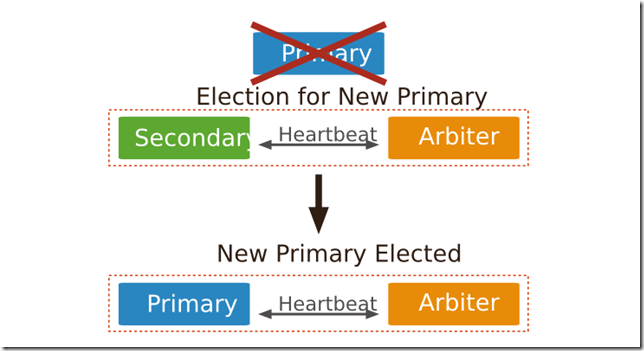

# MongoDB副本集+Keepalived部署高可用集群

- 部署MongoDB(1主+1从+1仲裁)副本集+Keepalived的高可用集群

节点类型|说明
-|-
主节点 - Primary|在复制集中，主节点是唯一能够接收写请求的节点。MongoDB在主节点进行写操作，并将这些操作记录到主节点的oplog中。而从节点将会从oplog复制到其本机，并将这些操作应用到自己的数据集上。（复制集最多只能拥有一个主节点）
从节点 - Secondary|从节点通过应用主节点传来的数据变动操作来保持其数据集与主节点一致。从节点也可以通过增加额外参数配置来对应特殊需求。例如，从节点可以是non-voting或是priority 0.
仲裁节点 - ARBITER|仲裁节点即投票节点，其本身并不包含数据集，且也无法晋升为主节点。但是，旦当前的主节点不可用时，投票节点就会参与到新的主节点选举的投票中。仲裁节点使用最小的资源并且不要求硬件设备。投票节点的存在使得复制集可以以偶数个节点存在，而无需为复制集再新增节点 不要将投票节点运行在复制集的主节点或从节点机器上。 投票节点与其他 复制集节点的交流仅有：选举过程中的投票，心跳检测和配置数据。这些交互都是不加密的。




- 心跳检测
复制集成员每两秒向复制集中其他成员进行心跳检测。如果某个节点在10秒内没有返回，那么它将被标记为不可用。

- 同步过程
Primary节点写入数据，Secondary通过读取Primary的oplog得到复制信息，开始复制数据并且将复制信息写入到自己的oplog。如果某个操作失败，则备份节点停止从当前数据源复制数据。如果某个备份节点由于某些原因挂掉了，当重新启动后，就会自动从oplog的最后一个操作开始同步，同步完成后，将信息写入自己的oplog，由于复制操作是先复制数据，复制完成后再写入oplog，有可能相同的操作会同步两份，不过MongoDB在设计之初就考虑到这个问题，将oplog的同一个操作执行多次，与执行一次的效果是一样的。
**通俗理解：当Primary节点完成数据操作后，Secondary会做出一系列的动作保证数据的同步**

>1、检查自己local库的oplog.rs集合，找出最近的时间戳。
>2、检查Primary节点local库oplog.rs集合，找出大于此时间戳的记录。
>3、将找到的记录插入到自己的oplog.rs集合中，并执行这些操作。

副本集的同步和主从同步一样，都是异步同步的过程，不同的是副本集有个自动故障转移的功能。其原理是：slave端从primary端获取日志，然后在自己身上完全顺序的执行日志所记录的各种操作（该日志是不记录查询操作的），这个日志就是local数据 库中的oplog.rs表，默认在64位机器上这个表是比较大的，占磁盘大小的5%，oplog.rs的大小可以在启动参数中设 定：–oplogSize 1000,单位是M。

- **注意：**
在副本集的环境中，要是所有的Secondary都宕机了，只剩下Primary。最后Primary会变成Secondary，不能提供服务。

### 1. 部署前准备
**1.1. 禁用Linux的THP功能(大内存页面)**
```
# cat << . >> /etc/rc.d/rc.local && chmod +x /etc/rc.d/rc.local
if [ -f /sys/kernel/mm/transparent_hugepage/enabled ]; then
  echo never > /sys/kernel/mm/transparent_hugepage/enabled
fi
if [ -f /sys/kernel/mm/transparent_hugepage/defrag ]; then
  echo never > /sys/kernel/mm/transparent_hugepage/defrag
fi
.
```
**1.2. 创建用户,用户组,数据目录**
```
# groupadd -g 800 mongod \
  && useradd -s /sbin/nologin -u 800 -g mongod mongod \
  && mkdir -p /data/mongo/ \
  && chown -R mongod:mongod /data/mongo/
```
**1.3. 创建keyfile(用于集群通信)**
```
# openssl rand -base64 666 > /data/mongo/keyfile
# chmod 600 /data/mongo/keyfile
```

### 2. MongoDB副本集规划

主机名|地址|端口|默认角色
-|-|-|-
mongo-0|192.168.80.11|27017|primary
mongo-1|192.168.80.12|27017|secondary
mongo-2|192.168.80.13|27017|arbiter

### 3. 部署MongoDB服务
**3.1. MongoDB怎么使用**
- 启动:`mongod -f /etc/mongo.conf`
- 停止:`mongod -f /etc/mongo.conf --shutdown`
- 使用pkill停止服务:`pkill -2 mongod`

**3.2. 在所有机器上,部署MongoDB**
```
# cd /root/soft/ \
  && curl -O https://fastdl.mongodb.org/linux/mongodb-linux-x86_64-rhel70-3.6.8.tgz \
  && tar -xf mongodb-linux-x86_64-rhel70-3.6.8.tgz \
  && mv mongodb-linux-x86_64-rhel70-3.6.8 /usr/local/mongdb-3.6.8 \
  && for i in $(ls /usr/local/mongdb-3.6.8/bin/);do ln -sf $i /usr/bin/;done
```
**3.3. 创建MongoDB的配置文件**
```
# cat << . > /etc/mongod.conf
#监听0.0.0.0:27017
bind_ip_all=true
port=27017
#数据库目录
dbpath=/data/mongo/
#副本集名称
replSet=rs0
#开启登录验证,默认先不开启,添加用户后再开启
auth=false
#keyFile=/data/mongo/keyfile
#以守护进程的方式运行MongoDB，创建服务器进程
fork=true
#设置每个数据库将被保存在一个单独的目录
directoryperdb=true
#pid文件
pidfilepath=/data/mongo/mongo_27017.pid
#日志配置
logpath=/data/mongo/mongo_27017.log
logappend=true
#启用日志选项，MongoDB的数据操作将会写入到journal文件夹的文件里
journal=true
# 在收到客户数据,检查的有效性
objcheck=true
#操作日志大小限制2G
oplogSize=2048
#0：关闭，不收集任何数据。1：收集慢查询数据，默认是100毫秒。2：收集所有数据
profile=1
slowms=100
#.禁止HTTP状态接口
nohttpinterface=true
#.禁止REST接口-在生产环境下建议不要启用MongoDB的REST接口
rest=false
.
```
**3.4. 创建MongoDB的启动文件**
```
# echo '#!/bin/bash
MONGOD=/usr/bin/mongod
MONGOCONF=/etc/mongod.conf
InfoFile=/tmp/start.mongo
. /etc/init.d/functions
status(){
  PID=$(awk 'NR==2{print $NF}' $InfoFile)
  Run_Num=$(ps -p $PID|wc -l)
  if [ $Run_Num -eq 2 ]; then
    echo "MongoDB is running"
  else
    echo "MongoDB is shutdown"
    return 3
  fi
}
start() {
  status &>/dev/null
  if [ $? -ne 3 ];then
    action "启动MongoDB,服务运行中..."  /bin/false
    exit 2
  fi
  sudo su - mongod -s /bin/bash -c "$MONGOD -f $MONGOCONF" >$InfoFile 2>/dev/null
  if [ $? -eq 0 ];then
    action "启动MongoDB"  /bin/true
  else
    action "启动MongoDB"  /bin/false
  fi
}
stop() {
  sudo su - mongod -s /bin/bash -c "$MONGOD -f $MONGOCONF --shutdown"  &>/dev/null
  if [ $? -eq 0 ];then
    action "停止MongoDB"  /bin/true
  else
    action "停止MongoDB"  /bin/false
  fi
}
case "$1" in
start)
  start;;
stop)
  stop;;
restart)
  stop && sleep 2 && start;;
status)
  status;;
*)
  echo $"Usage: $0 {start|stop|restart|status}" && exit 1;;
esac' > /etc/init.d/mongod && chmod 755 /etc/init.d/mongod
```
### 4. 配置MongoDB副本集(1主+1从+1仲裁)
**4.1. 在任意一台实例配置**
```
# mongo 192.168.80.254:27000
> use admin;
switched to db admin
> config = { _id:"rs0", members:[ {_id:0,host:"192.168.80.11:27017",priority:2}, {_id:1,host:"192.168.80.12:27017",priority:1}, {_id:2,host:"192.168.80.13:27017",arbiterOnly:true} ] };
```

**4.2. 初始化副本集**
```
> rs.initiate(config);
```

**4.3. 查看同步状态**
```
> rs.status();
```

**4.4. 验证同步数据一致性**
4.4.1. 去主库m0录入数据
```
# mongo 192.168.80.11:27017
repset:PRIMARY> use my_test;
repset:PRIMARY> db.my_test.insert({"uid":"20180921"},{"uname":"centos"});
repset:PRIMARY> exit
```

4.4.2. 去备库m1检查数据
```
# mongo 192.168.80.12:27017
repset:SECONDARY> use my_test;
repset:SECONDARY> show tables; //mongodb默认是从主节点读写数据的，副本节点上不允许读，需要设置副本节点可以读。
repset:SECONDARY> db.getMongo().setSlaveOk();
repset:SECONDARY> show tables;
repset:SECONDARY> db.my_test.find();
repset:SECONDARY> exit
```
4.4.3. 去备库m2检查数据
```
# mongo 192.168.80.12:27017
repset:SECONDARY> use my_test;
repset:SECONDARY> show tables; //mongodb默认是从主节点读写数据的，副本节点上不允许读，需要设置副本节点可以读。
repset:SECONDARY> db.getMongo().setSlaveOk();
repset:SECONDARY> show tables;
repset:SECONDARY> db.my_test.find();
repset:SECONDARY> exit
```

### 5. 添加用户认证
**5.1. MongoDB用户中权限的说明**

权限|说明
-|-
Read|允许用户读取指定数据库
readWrite|允许用户读写指定数据库
dbAdmin|允许用户在指定数据库中执行管理函数，如索引创建、删除，查看统计或访问system.profile
userAdmin|允许用户向system.users集合写入，可以找指定数据库里创建、删除和管理用户
clusterAdmin|只在admin数据库中可用，赋予用户所有分片和复制集相关函数的管理权限。
readAnyDatabase|只在admin数据库中可用，赋予用户所有数据库的读权限
readWriteAnyDatabase|只在admin数据库中可用，赋予用户所有数据库的读写权限
userAdminAnyDatabase|只在admin数据库中可用，赋予用户所有数据库的userAdmin权限
dbAdminAnyDatabase|只在admin数据库中可用，赋予用户所有数据库的dbAdmin权限。
root|只在admin数据库中可用。超级账号，超级权限
- 更多关于用户权限的说明参照：`https://docs.mongodb.com/manual/core/security-built-in-roles/`

**5.2. 创建用户**
```
> use <库名>
> db.createUser({
  user:"<用户名>",
  pwd:"<密码>",
  cusomData:{<任意内容,比如介绍等>},
  roles:[{role:"<权限>",db:"<库名>"},...]})
> db.createUser({
  user:"<用户名>",
  pwd:"<密码>",
  cusomData:{<任意内容,比如介绍等>},
  roles:["<权限>",...]})
> db.createUser({user:"admin",pwd:"admin",roles:["root"]})
> db.createUser({user:"app",pwd:"123",roles:["readWrite","dbAdmin","userAdmin"]})
```

**5.3. 修改配置文件并重启服务**
```
# vim /etc/mongod.conf
...
auth=true
...
```
- 关闭顺序注意下，mongodb集群有自动切换主库功能，如果先关主库，主库就切换到其它上面去了，这里预防主库变更，从库关闭后再关闭主库。
